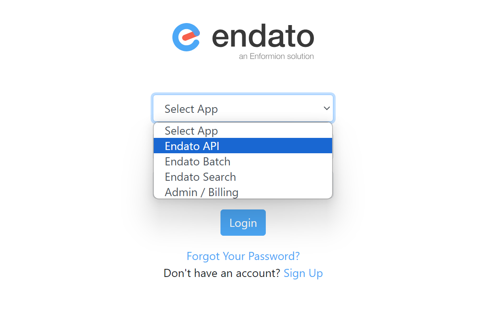
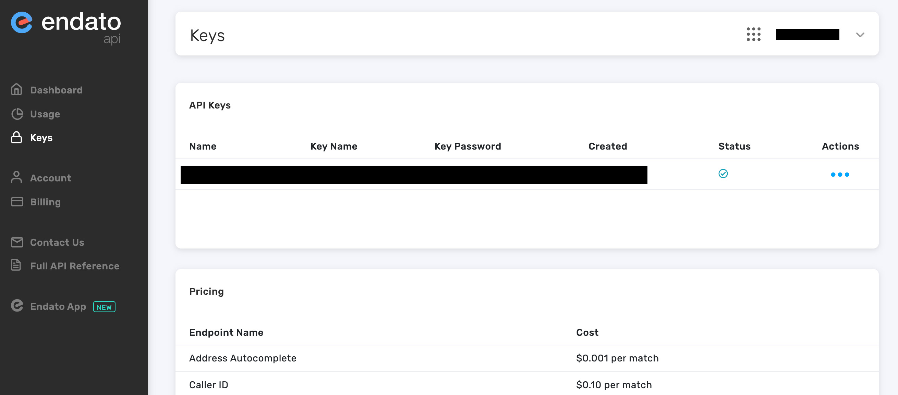
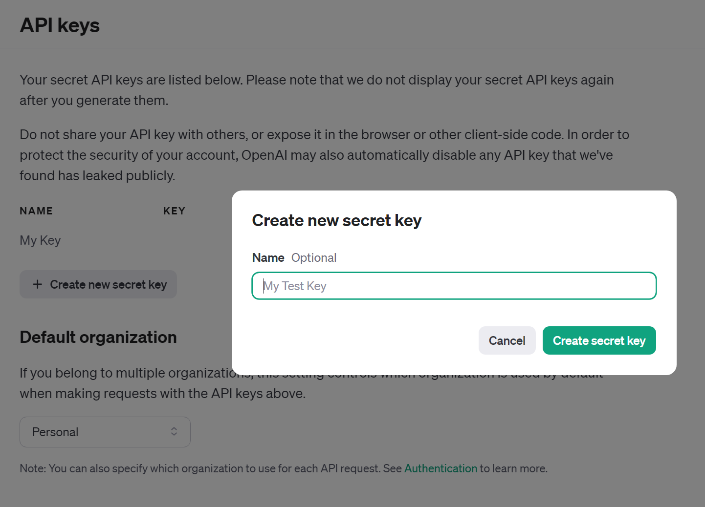
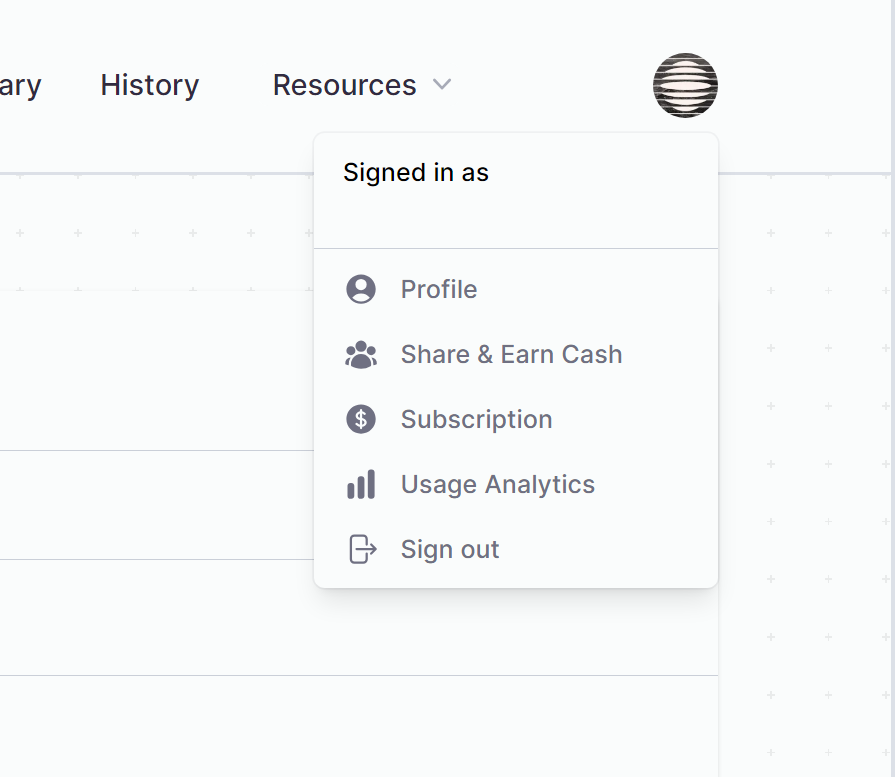

# LiamAI, Powered by Eleven Labs, ChatGPT, Endato and Twilio


## What is it?

LiamAI is an AI with the ability to talk over the phone and one small twist, it has the ability to search public records on the fly for information related to the caller.

This information is then used in a prompt sent to GPT-4 and can be presented in anyway you like. By default, the ai is instructed to perform a threatening Liam Neeson impression from Taken.

The AI relies on 4 services,

1. Endato - https://endato.com/ Public information database, used to find details on the caller
2. OpenAI - https://openai.com/ GPT-4 generates a threat based upon user information
3. Eleven Labs (Optional) - https://elevenlabs.io/ - Provides realistic text to speech services
4. Twilio - https://www.twilio.com/en-us Makes it easy to make and recieve phone calls using their API.

## How to setup the AI 🤖

To get the AI working, you will need to install its dependencies and then setup API keys for all the services listed above. The application was built using Node v18.17.1.

## Installing node dependencies

Navigate to the root folder of the project and run `yarn`.

```
MrWebMD@readme:~/liam-ai$ yarn
yarn install v1.22.21
...
Done in 2.86s.
```

## Installing FFMPEG

FFMPEG is an application that can be used to manipulate media files. After installation it must be added to your PATH variable.

```
sudo apt install ffmpeg
```

Here is a comprehensive guide on how to install FFMPEG on windows.

https://www.youtube.com/watch?v=IECI72XEox0

You can verify your installation by running the `ffmpeg` command in a terminal window

```
~
❯ ffmpeg
ffmpeg version N-113018-gbe8a4f80b9-20231218 Copyright (c) 2000-2023 the FFmpeg developers
  built with gcc 13.2.0 (crosstool-NG 1.25.0.232_c175b21)
```

## How to get your API keys 🔑

We're going to be filling out our `.env.example` file. As you follow along, place your resulting api key in the relevant place after the equal sign in the `.env.example` file.

```
TWILIO_AUTH_TOKEN=
TWILIO_ACCOUNT_SID=
ENDATO_API_KEY_NAME=
ENDATO_API_KEY_PASSWORD=
OPENAI_API_KEY=
OPENAI_MODEL=gpt-3.5-turbo
VOICE_ENDPOINT=/voice_XXXXXXXXXXXXXXXXXX
ELEVEN_LABS_API_KEY=
ELEVEN_MODEL=eleven_turbo_v2
ELEVEN_VOICE_ID=g5CIjZEefAph4nQFvHAz
GA4_TRACKING_CODE=
NODE_ENV=production
PORT=1337
VOICE_MODE=false
RECORD=false
STREAM_MODE=false
MAX_CALL_DURATION_SEC=180
```

## Endato (Free tier provides 100 lookups per month)

[Comprehensive guide](https://endato.readme.io/reference/overview#create-an-account-and-get-your-key)

Create an account using this page https://accounts.endato.com/Join?uf=1 . **Fair warning, you will be welcomed with the website showing you all the information they have on you.** The company name you provide doesn't have to be real.

Now, sign in here https://accounts.endato.com/Account/Login .

In the dropdown that says "Select App", choose "Endato API"



You are now able to click on actions and then click on "Copy Key Name" and "Copy Key Password". Paste those keys in the relevant fields of your env file and save.

```
ENDATO_API_KEY_NAME=XXXXXXXXXX
ENDATO_API_KEY_PASSWORD=XXXXXXXXX
```



## OpenAI

[Comprehensive Guide](https://platform.openai.com/docs/quickstart/account-setup)

Create an account on OpenAI https://platform.openai.com/signup and then sign in https://platform.openai.com/login.

You can now navigate to the api keys page by clicking this link https://platform.openai.com/api-keys .

Click "Create new secret key", give it any name you want. Now copy the new key's contents into this field of your env



```
OPENAI_API_KEY=XXXXXXXXXXXXX
OPENAI_MODEL=gpt-3.5-turbo
```

By default GPT-3 is used because GPT-4 is premium. If you want to use GPT-4 You can change `gpt-3.5-turbo` to `gpt-4` in your env file.

## Eleven Labs 🗪

This section is optional. When you don't supply this key, a regular choppy ai voice will be used.

After you have signed up, sign in on this page https://elevenlabs.io/sign-up. When signed in over over your user icon on the top right, then click "Profile". You will then be met with a form that tells you your api key. Copy this key into the relevant env field.

```
ELEVEN_LABS_API_KEY=XXXXXXXXXX
```



## Twilio 📞

Last one! Create an account on https://login.twilio.com/ , **you'll get $15 of free trial credits if this is your first time**. Now login here https://www.twilio.com/login .
